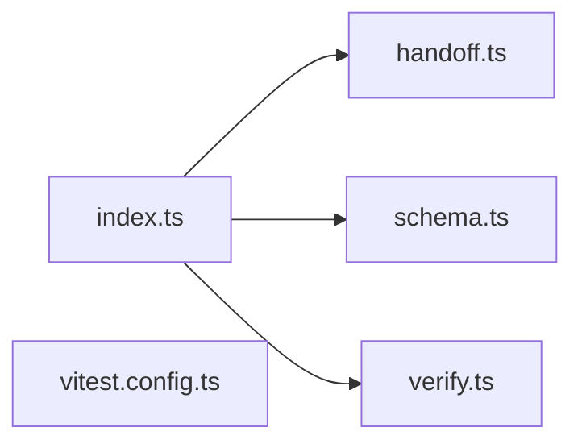

# @wren/auth

Role: package. Files: 5.

## Uses

- @wren/db

## Folders

Dotted: types only.

```mermaid
flowchart LR
  nhandoff_ts["handoff.ts"]
  nindex_ts["index.ts"]
  nschema_ts["schema.ts"]
  nverify_ts["verify.ts"]
  nvitest_config_ts["vitest.config.ts"]
  nindex_ts --> nhandoff_ts
  nindex_ts --> nschema_ts
  nindex_ts --> nverify_ts
```

## Files

- handoff.ts
- index.ts
- schema.ts
- verify.ts
- vitest.config.ts
