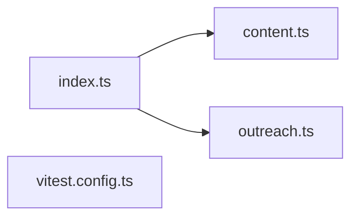

# @wren/channel-linkedin

Role: package. Files: 4.

## Uses

- @wren/core

## Folders

Dotted: types only.

```mermaid
flowchart LR
  nindex_ts["index.ts"]
  ncontent_ts["content.ts"]
  noutreach_ts["outreach.ts"]
  nvitest_config_ts["vitest.config.ts"]
  nindex_ts --> ncontent_ts
  nindex_ts --> noutreach_ts
```

## Files

- content.ts
- index.ts
- outreach.ts
- vitest.config.ts
