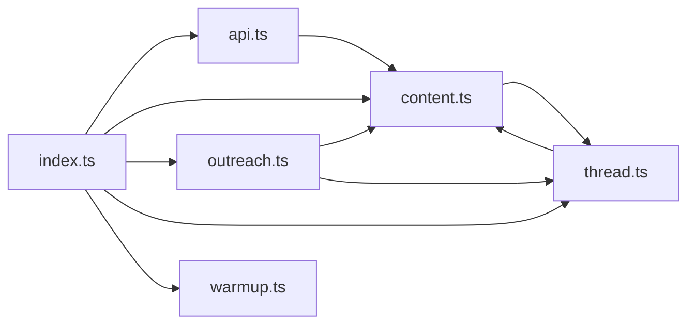

# @wren/channel-reddit

Role: package. Files: 6.

## Uses

- @wren/core

## Folders

Dotted: types only.

```mermaid
flowchart LR
  napi_ts["api.ts"]
  ncontent_ts["content.ts"]
  nindex_ts["index.ts"]
  noutreach_ts["outreach.ts"]
  nthread_ts["thread.ts"]
  nwarmup_ts["warmup.ts"]
  napi_ts --> ncontent_ts
  ncontent_ts --> nthread_ts
  nindex_ts --> napi_ts
  nindex_ts --> ncontent_ts
  nindex_ts --> noutreach_ts
  nindex_ts --> nthread_ts
  nindex_ts --> nwarmup_ts
  noutreach_ts --> ncontent_ts
  noutreach_ts --> nthread_ts
  nthread_ts --> ncontent_ts
```

## Files

- api.ts
- content.ts
- index.ts
- outreach.ts
- thread.ts
- warmup.ts
