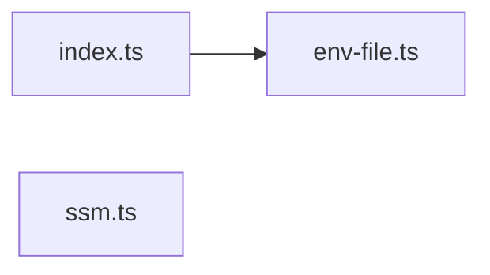

# @wren/config

Role: package. Files: 3.

## Outside packages

node:fs, node:path

## Folders

Dotted: types only.

```mermaid
flowchart LR
  nenv_file_ts["env-file.ts"]
  nindex_ts["index.ts"]
  nssm_ts["ssm.ts"]
  nindex_ts --> nenv_file_ts
```

## Files

- env-file.ts
- index.ts
- ssm.ts
