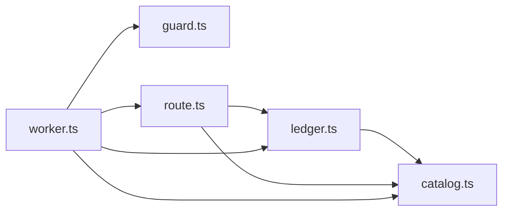

# @wren/llm-gateway

Role: package. Files: 5.

## Outside packages

cloudflare:workers

## Folders

Dotted: types only.

```mermaid
flowchart LR
  ncatalog_ts["catalog.ts"]
  nguard_ts["guard.ts"]
  nledger_ts["ledger.ts"]
  nroute_ts["route.ts"]
  nworker_ts["worker.ts"]
  nledger_ts --> ncatalog_ts
  nroute_ts --> ncatalog_ts
  nroute_ts --> nledger_ts
  nworker_ts --> ncatalog_ts
  nworker_ts --> nguard_ts
  nworker_ts --> nledger_ts
  nworker_ts --> nroute_ts
```

## Files

- catalog.ts
- guard.ts
- ledger.ts
- route.ts
- worker.ts
